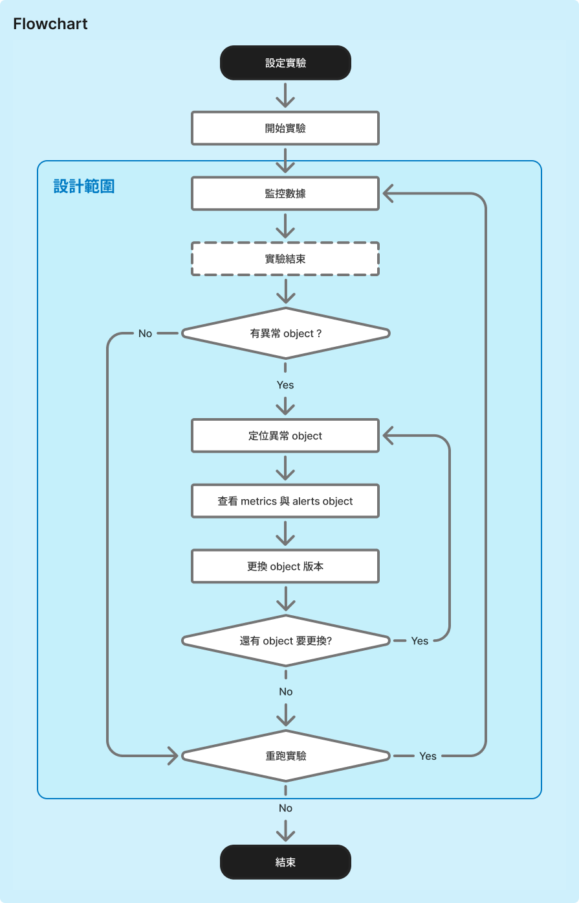

# Sim Monitor Dashboard

工程模擬監控儀表板的互動原型，以 Vue 3 實作，基於完整 Figma 設計稿開發。

**Live Demo：** https://yode0419.github.io/sim-monitor-dashboard/

---

## 情境與設計範圍

使用者是負責跑實驗模擬的工程師，模擬伺服器散熱系統的運作行為，實驗由多個設備物件組成（風扇、散熱片、機架等），系統同時監控各物件的即時指標（溫度、轉速、功率密度等）。核心痛點是：異常出現時，數據量大，難以快速判斷是哪個物件造成問題。

設計範圍聚焦在「監控 → 診斷 → 版本切換 → 重跑」這段操作閉環，設定實驗與初次執行不在範疇內。



---

## 核心功能

- **即時模擬引擎** — 每 500ms 推進一個 tick，共 20 ticks（約 10 秒），動態更新各物件的指標數值
- **自動警報觸發** — 指標超過 warning / critical 閾值時自動新增 alert，並寫入 Log
- **版本切換流程** — Stop → Change Version → Apply → Revert，物件列表與詳情面板全程同步視覺狀態
- **服務層隔離** — 所有資料存取透過 `experimentService.ts`（含模擬 delay），元件不直接接觸 mock 資料

---

## 技術架構

- **框架**：Vue 3 + Composition API + TypeScript
- **建置**：Vite
- **UI 元件庫**：Element Plus
- **狀態管理**：Pinia
- **圖表**：vue-chartjs + chart.js

---

## 快速啟動

```bash
npm install
npm run dev
```

```bash
npm run build   # 型別檢查 + 打包
npm run lint    # oxlint → eslint，皆帶 --fix
```

---

## 介面說明

```
┌─ Sidebar ──┬──────────────────────────────────────────────┐
│            │ Header（實驗名稱、狀態、Stop / Re-run 控制）   │
│            ├──────────────────┬───────────────────────────┤
│            │ 3D Heatmap 預覽  │ Objects 面板               │
│            │ + KPI Cards      │  ├─ Object List（物件列表）│
│            ├──────────────────│  └─ Object Detail          │
│            │ Log Panel        │     ├─ Metrics + Sparkline │
│            │                  │     ├─ Alerts              │
│            │                  │     └─ Change Version 按鈕 │
└────────────┴──────────────────┴───────────────────────────┘
```

---

## Demo 操作流程

1. 開啟應用程式 — 實驗自動以 **Running** 狀態啟動，Header 顯示計時器與進度條
2. 等待幾個 tick，觀察物件的指標從 Normal 升為 Warning → Critical，Log 同步記錄
3. 點擊任意物件，右側 Detail 面板顯示各指標數值、Sparkline 折線圖，以及 Alert 描述
4. 點擊 **Stop** 停止實驗，此時 **Change Version** 按鈕變為可用
5. 點擊 **Change Version** → 選擇版本 → **Apply**
   - 物件列表該物件顯示變更指示點
   - Detail 面板切換為空白狀態（版本切換中）
6. 點擊 **Revert** 恢復至前一版本，或點擊 **Re-run** 重新從頭執行模擬

---

## 專案架構與資料流

```
src/
├── types/index.ts                       # 所有 TypeScript 型別定義
├── data/
│   ├── simulationConfig.ts              # TOTAL_TICKS、TICK_INTERVAL_MS
│   ├── scriptGenerator.ts               # 根據模板動態產生指標數值序列（含 noise + drift）
│   ├── mockMetricTemplates.ts           # 各物件的指標模板（閾值、基準值、漂移量）
│   └── mock*.ts                         # 靜態種子資料（實驗、物件、KPI、警報）
├── services/experimentService.ts        # 非同步 API 模擬 + SSE-like 串流訂閱
├── stores/
│   ├── experiment.ts                    # 實驗狀態、進度、計時
│   ├── monitor.ts                       # 指標 map、alerts、KPI items、log
│   ├── object.ts                        # 物件列表、選取狀態、版本切換標記
│   └── version.ts                       # 各物件版本清單、版本切換前的快照
├── composables/
│   ├── useExperimentStream.ts           # 模擬引擎（singleton），將每個 tick 分派至各 store
│   └── useExperimentSession.ts          # 跨 store 衍生狀態 + 業務動作（停止、重跑、版本操作）
└── components/                          # UI 元件；資料僅透過 service 層或 composable 取得
```

**資料處理流程：**

1. **初始化**：App 掛載時，透過 `experimentService` 的模擬 API（含 300–500ms delay）非同步載入實驗、物件清單、版本資料，分別注入對應 store
2. **腳本產生**：`monitor store` 初始化時，`scriptGenerator` 依據每個物件的指標模板（基準值、每 tick 漂移量、隨機雜訊範圍）預先產生完整的數值序列
3. **模擬推進**：`useExperimentStream`（singleton）每 500ms 觸發一個 tick，依序呼叫各 store 的 tick mutation — 推進指標值、更新 KPI、觸發 alert、寫入 log、更新物件整體狀態
4. **跨 store 聚合**：`useExperimentSession` 組合多個 store 的資料，對外暴露衍生狀態（選取物件的指標、alerts、版本清單）及業務動作（Stop、Re-run、Apply / Revert 版本）
5. **版本切換**：Apply 版本時，先將物件當前 `{alertCount, status}` 快照存入 `version store`，再標記物件為「版本切換中」（清零 alert、顯示空狀態）；Revert 時還原快照並回寫 store
6. **元件層**：所有元件只透過 `useExperimentSession` 或各 store 的 ref 讀取資料，不直接操作 mock data 或呼叫 service
